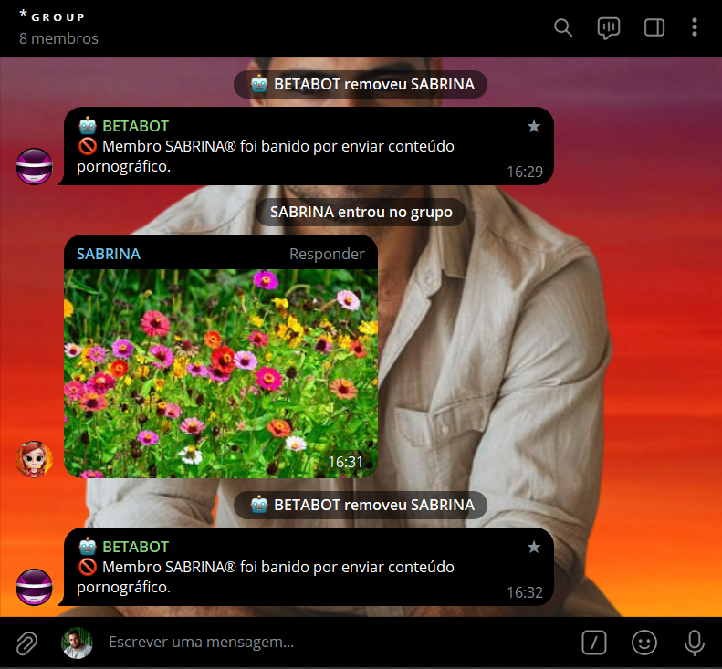
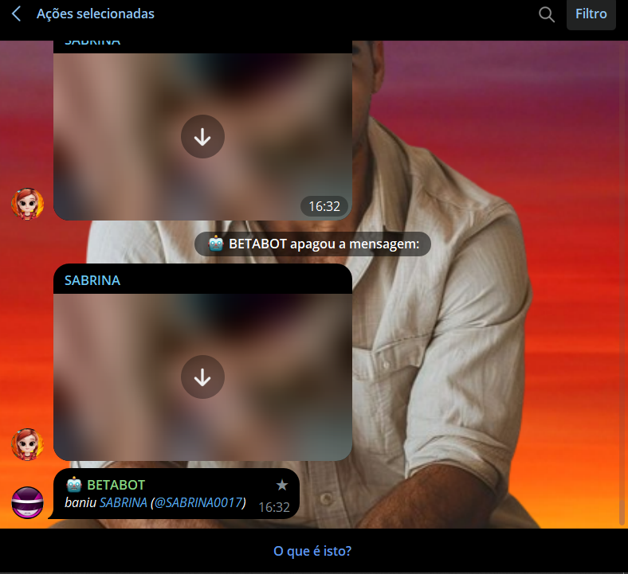
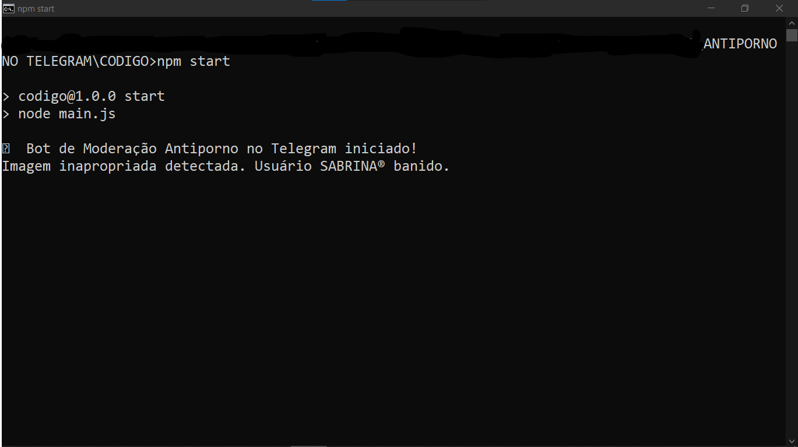

# ANTIPORNO NO TELEGRAM
🤖ESTE É UM BOT DE MODERAÇÃO PARA GRUPOS NO TELEGRAM. ELE IDENTIFICA E REMOVE IMAGENS PORNOGRÁFICAS ENVIADAS NO GRUPO E BANE O MEMBRO RESPONSÁVEL POR ENVIAR CONTEÚDO IMPRÓPRIO.

  
  
  

## DESCRIÇÃO:
Este bot de moderação no Telegram tem a finalidade de detectar e gerenciar conteúdo impróprio, especificamente imagens pornográficas, enviadas em um grupo. 

## FUNCIONALIDADES:
1. **Detecção de Imagens Inapropriadas:** 
   - O bot usa a API do Google Cloud Vision para detectar se as imagens enviadas são pornográficas ou têm conteúdo impróprio. 
   - Imagens de formatos suportados como `.jpg`, `.jpeg`, e `.png` são analisadas.

2. **Gerenciamento de Conteúdo:**
   - Se uma imagem é identificada como inapropriada, o bot exclui a mensagem e bane o membro que enviou a imagem do grupo.
   - Além disso, o bot envia uma mensagem ao grupo notificando que o membro foi banido por enviar conteúdo pornográfico.

3. **Suporte a Diferentes Tipos de Arquivos:**
   - O bot pode processar imagens, GIFs e vídeos. No entanto, a detecção de conteúdo é feita apenas para imagens, enquanto GIFs e vídeos são ignorados no processo de moderação.

## OBSERVAÇÕES:
- **Formatos de Arquivo:** O bot atualmente processa apenas imagens (`.jpg`, `.jpeg`, `.png`). GIFs e vídeos são aceitos, mas não são analisados quanto ao conteúdo.
- **Notificação:** O bot envia uma notificação ao grupo quando um membro é banido devido ao envio de conteúdo pornográfico.

