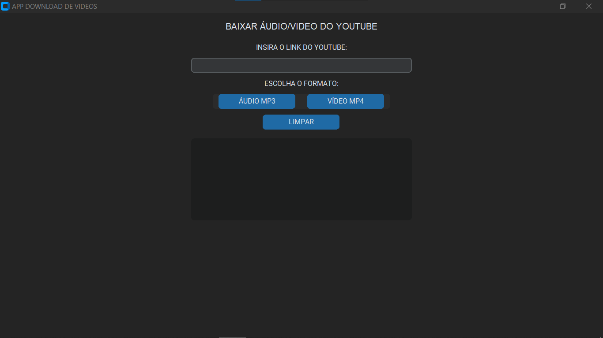
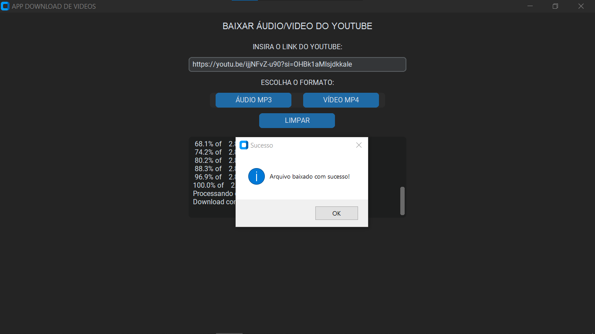
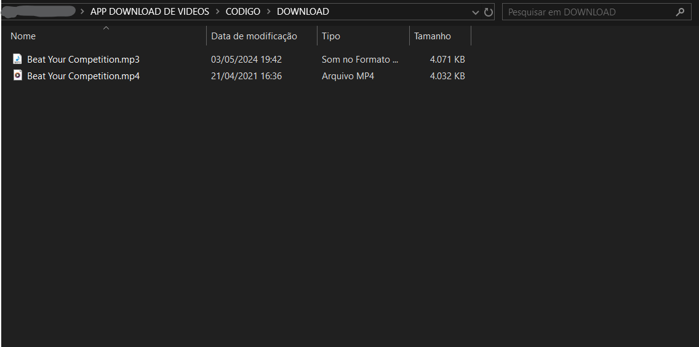

# APP DOWNLOAD DE VIDEOS
📱ESSE É UM APP QUE BAIXA VIDEOS E MÚSICAS DO YOUTUBE.

  
  
  

## DESCRIÇÃO:
Este é um app desenvolvido em **Python** usando o **CustomTkinter** (interface gráfica moderna) e a biblioteca **yt-dlp** para baixar vídeos ou áudios do YouTube. Ele permite ao usuário baixar vídeos em formato MP4 ou áudios em formato MP3, com uma interface simples.

## RECURSOS:
1. **Interface gráfica moderna**: Apresenta uma interface amigável e moderna usando **CustomTkinter** para facilitar a inserção do link do YouTube.
2. **Escolha de formato**: O usuário pode escolher entre baixar o áudio no formato **MP3** ou o vídeo no formato **MP4**.
3. **Status do download bloqueado**: O campo de status é de leitura apenas, evitando que o usuário o edite, enquanto exibe atualizações do progresso e mensagens.
4. **Notificações de status**: Informa ao usuário o estado atual do download, como "Iniciando o download...", "Baixando: 50%", "Processando o arquivo..." ou "Download concluído".
5. **Botão de limpar**: Permite ao usuário limpar o campo do link e as mensagens de status a qualquer momento.
6. **Diretório de download personalizado**: Os arquivos são baixados automaticamente para um diretório específico chamado `DOWNLOAD`, criado no mesmo local onde o app é executado.
   
