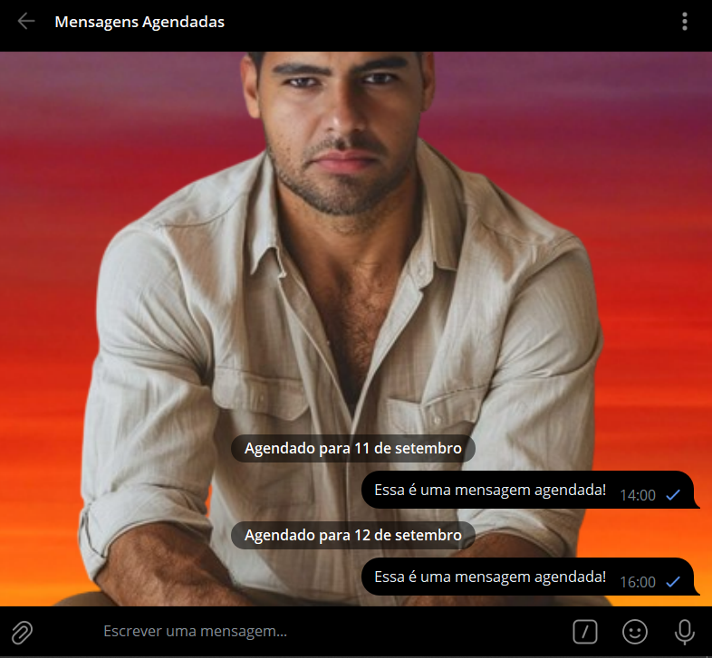
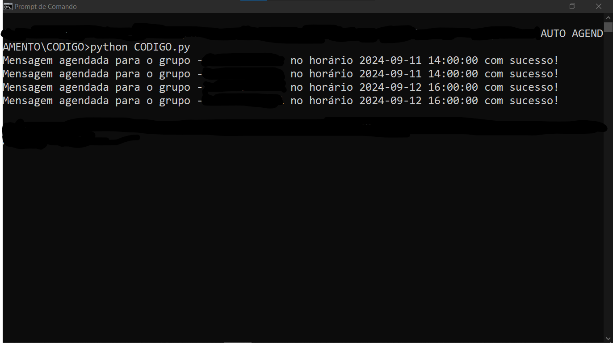
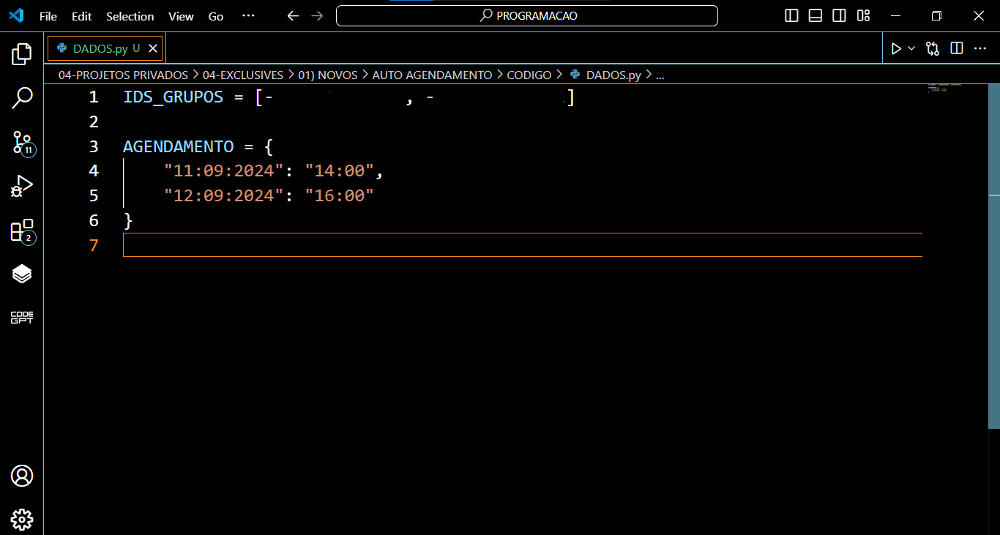
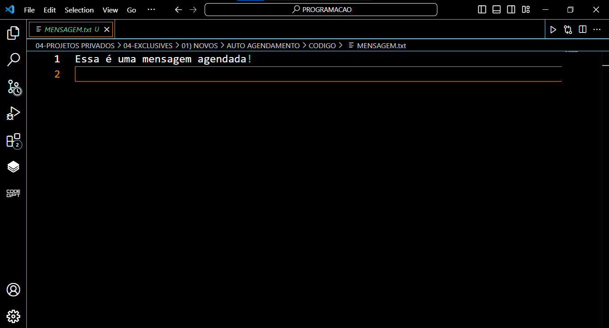

# AUTO AGENDAMENTO
🤖USE SEU PERFIL PESSOAL DO TELEGRAM PARA AGENDAR MENSAGENS EM GRUPOS AUTOMATICAMENTE!

  
  
  
  

## DESCRIÇÃO:
Este bot foi desenvolvido para facilitar o agendamento automático de mensagens em grupos do Telegram. Utilizando a biblioteca Pyrogram, o bot permite que você configure mensagens para serem enviadas em horários específicos.

O bot lê as configurações de agendamento a partir de um arquivo de configuração chamado `DADOS.py`. Nele, você define quais grupos receberão as mensagens e em quais datas e horários essas mensagens devem ser enviadas. A mensagem a ser enviada é lida a partir de um arquivo de texto chamado `MENSAGEM.txt`.

## FUNCIONALIDADES:
1. **Carregamento da Mensagem**: O bot lê o texto da mensagem que deve ser enviada a partir de um arquivo chamado `MENSAGEM.txt`.

2. **Agendamento de Mensagens**:
   - O bot utiliza informações de agendamento armazenadas em `DADOS.py`. O formato do agendamento é `DD:MM:AAAA` para a data e `HH:MM` para a hora.
   - Para cada data e hora especificadas em `AGENDAMENTO`, o bot agenda o envio da mensagem para todos os grupos cujos IDs estão listados em `IDS_GRUPOS`.

3. **Envio das Mensagens**:
   - As mensagens são enviadas para os grupos no horário agendado. A biblioteca Pyrogram é usada para interagir com a API do Telegram e realizar o agendamento.

