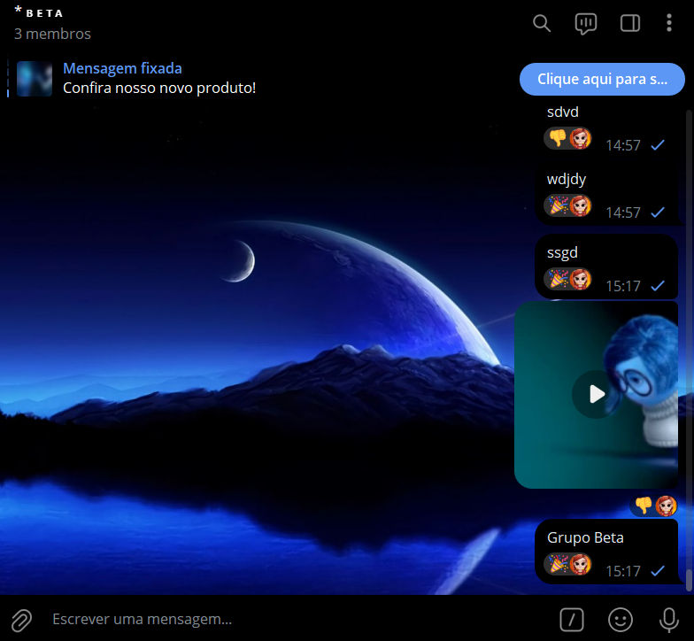
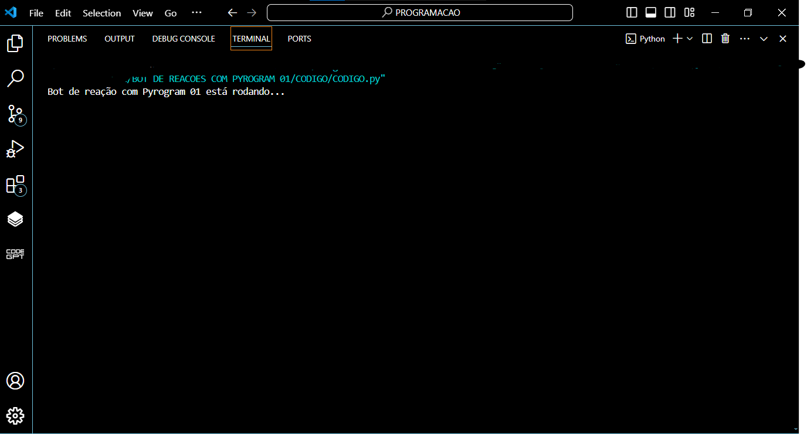

# BOT DE REACOES COM PYROGRAM 01
🤖USE SEU PERFIL PESSOAL DO TELEGRAM PARA REAGIR A UMA NOVA MENSAGEM POSTADA NOS GRUPOS ALEATORIAMENTE!

  
  

## DESCRIÇÃO:
Este bot, desenvolvido utilizando o Pyrogram, reage automaticamente a todas as mensagens postadas em um grupo do Telegram com uma reação aleatória. Ele utiliza uma lista de emojis pré-definidos para selecionar uma reação de forma aleatória e a envia como resposta a cada nova mensagem nos grupos que estiver presente.

- **Reações Aleatórias:** O bot escolhe aleatoriamente entre uma lista de emojis, incluindo '👍', '👎', '❤', '😄', '😊' e '🎉' (Você pode colocar mais emojis se quiser), para reagir a cada nova mensagem nos grupos.
- **Perfil Personalizado:** O bot pode ser personalizado com o avatar do seu perfil pessoal, ao invés de usar o avatar criado no @botfather.

