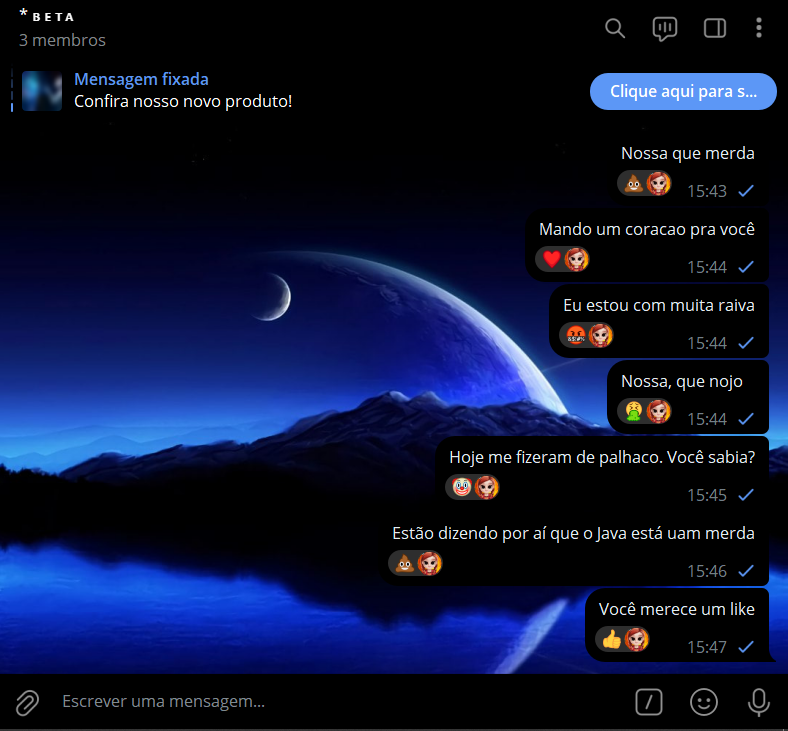
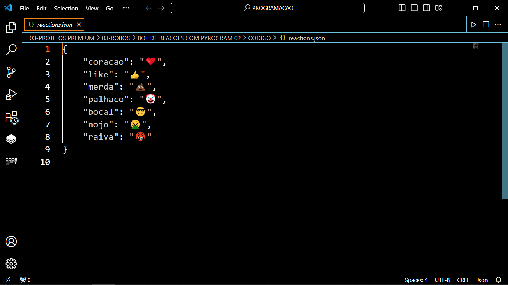
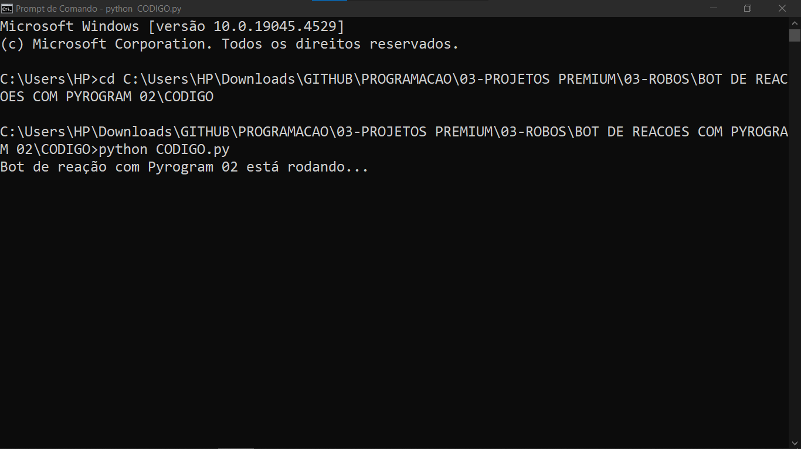

# BOT DE REACOES COM PYROGRAM 02
🤖USE SEU PERFIL PESSOAL DO TELEGRAM PARA REAGIR A UMA NOVA MENSAGEM POSTADA NOS GRUPOS AUTOMATIMANTE COM BASE EM PALAVRAS CHAVES!

  
  
  

## DESCRIÇÃO:
O bot foi criado para facilitar a interação em grupos do Telegram ao reagir automaticamente a mensagens que contenham palavras-chave específicas. Ele utiliza emojis correspondentes às palavras-chave encontradas nas mensagens.

## FUNCIONALIDADES:
1. **Reação Automática:**
   - Ao identificar uma palavra-chave definida no arquivo JSON de configuração (`reactions.json`), o bot envia automaticamente um emoji associado à palavra-chave como reação à mensagem.

2. **Perfil Personalizado:** 
    - O bot pode ser personalizado com o avatar do seu perfil pessoal, ao invés de usar o avatar criado no @botfather.

