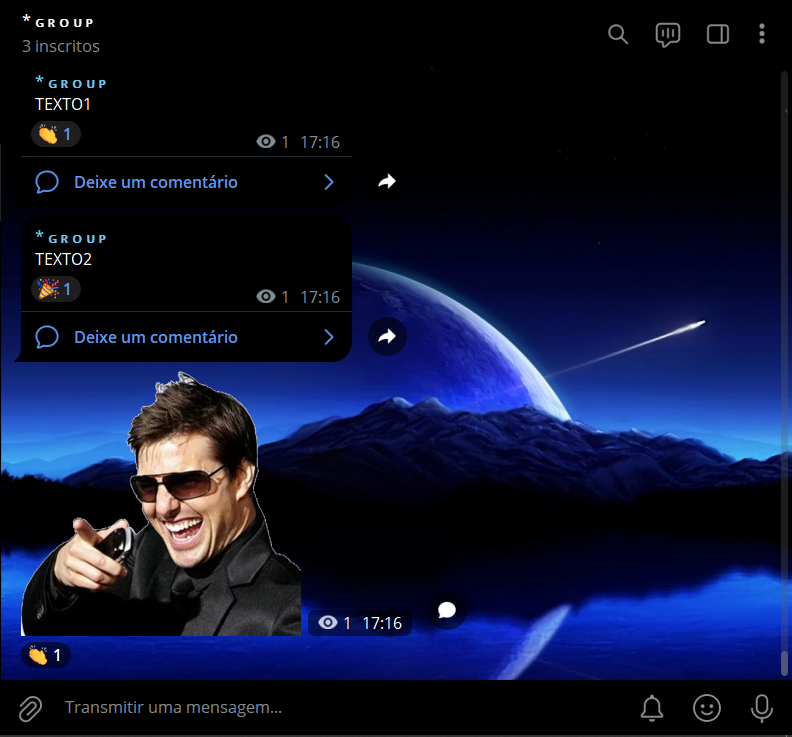
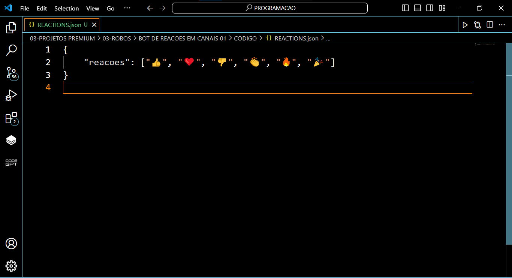

# BOT DE REACOES EM CANAIS 01
🤖ESTE BOT FOI PROJETADO PARA REAGIR A MENSAGENS POSTADAS EM UM CANAL DO TELEGRAM COM UMA REAÇÃO ALEATÓRIA. 

  
  

## DESCRIÇÃO:
Este bot Telegram é projetado para reagir automaticamente a todas as novas mensagens em um canal com um emoji aleatório. Ele é configurado de maneira flexível através de um arquivo JSON (`REACTIONS.json`), permitindo fácil personalização das reações sem a necessidade de modificar o código do bot.

## FUNCIONALIDADES:
1. **Reação Automática a Mensagens**:
   - O bot reage automaticamente a todas as novas mensagens no canal especificado.
   - Suporta todos os tipos de mensagens, incluindo texto, stickers, fotos, GIFs, áudios, documentos, vídeos, mensagens de voz, locais, contatos, enquetes e mais.

2. **Configuração via `REACTIONS.json`**:
   - As reações possíveis são definidas em um arquivo JSON, facilitando a personalização e extensão das reações.
   - A estrutura do JSON permite adicionar, remover ou modificar as reações sem alterar o código principal do bot.

3. **Reações Aleatórias**:
   - Para cada nova mensagem, o bot escolhe uma reação aleatória da lista definida no arquivo `REACTIONS.json`.
   - Garante que as interações sejam variadas e dinâmicas, tornando a experiência do canal mais divertida.

