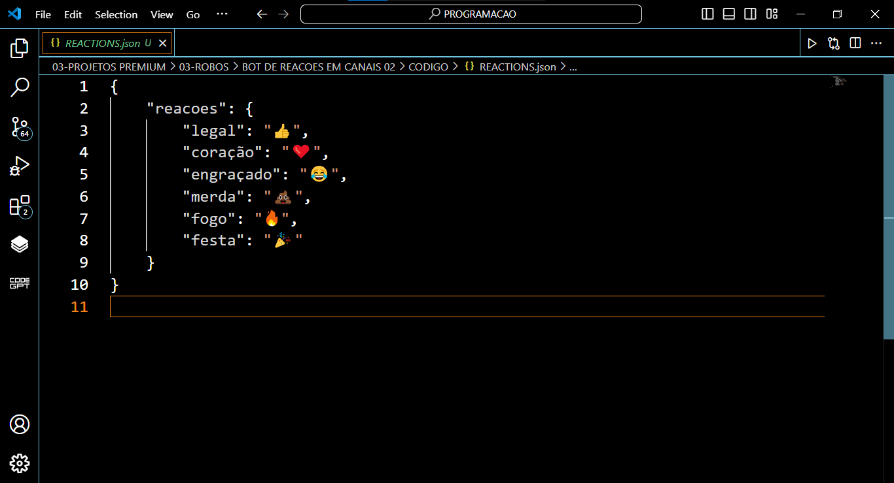

# BOT DE REACOES EM CANAIS 02
🤖ESTE BOT TELEGRAM É PROJETADO PARA REAGIR AUTOMATICAMENTE A NOVAS MENSAGENS EM UM CANAL COM EMOJIS ESPECÍFICOS, BASEADOS EM PALAVRAS-CHAVE DETECTADAS NAS MENSAGENS.

  
  

## DESCRIÇÃO:
Este bot Telegram é projetado para reagir automaticamente a novas mensagens em um canal com emojis específicos, baseados em palavras-chave detectadas nas mensagens. Utilizando um arquivo JSON (`REACTIONS.json`), o bot permite uma fácil configuração e personalização das reações para diferentes palavras-chave, tornando a interação no canal mais dinâmica e envolvente.

## FUNCIONALIDADES:
1. **Reação Automática com Base em Palavras-Chave**:
   - O bot analisa todas as novas mensagens no canal e procura por palavras-chave definidas.
   - Quando uma palavra-chave é encontrada, o bot reage com o emoji correspondente.

2. **Suporte a Vários Tipos de Mensagem**:
   - O bot pode reagir a uma ampla gama de tipos de mensagem, incluindo texto, stickers, fotos, áudios, documentos, vídeos, mensagens de voz, locais, contatos, enquetes e mais.

3. **Configuração via `REACTIONS.json`**:
   - As reações possíveis são definidas em um arquivo JSON, permitindo fácil personalização e extensão das reações.
   - Cada palavra-chave pode ter uma reação específica, facilitando a adaptação do bot às necessidades do canal.

