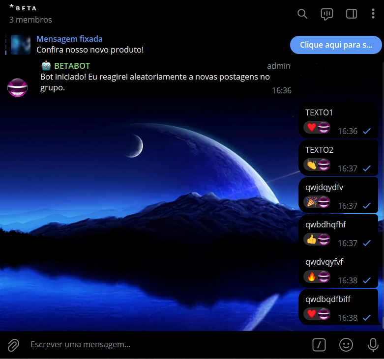
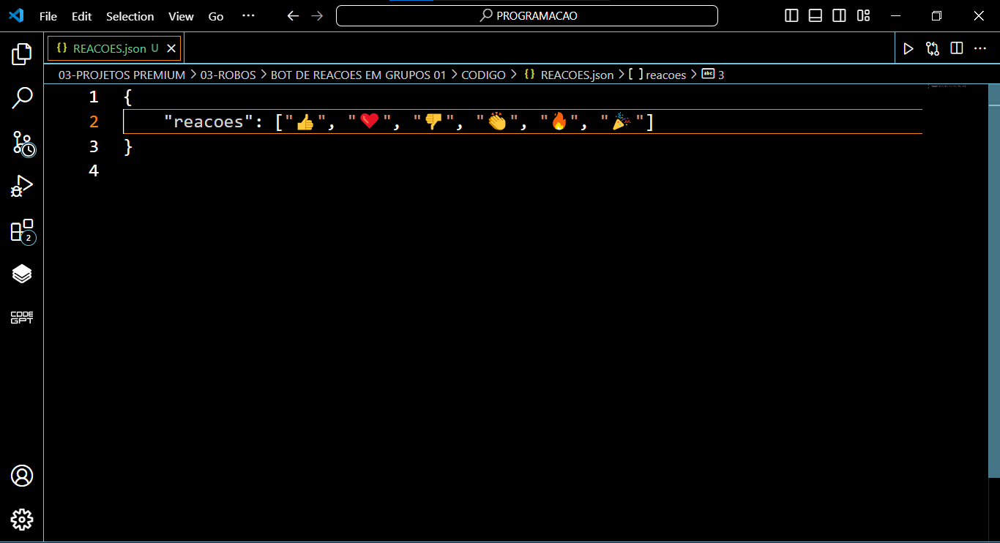

# BOT DE REACOES EM GRUPOS 01
🤖ESTE BOT TELEGRAM É PROJETADO PARA REAGIR AUTOMATICAMENTE A NOVAS MENSAGENS EM UM GRUPO COM UM EMOJI ALEATÓRIO.

  
  

## DESCRIÇÃO:
Este bot Telegram é projetado para reagir automaticamente a novas mensagens em um grupo com um emoji aleatório. As reações são configuradas de forma fácil e flexível através de um arquivo JSON (`REACOES.json`). Isso permite que os administradores do grupo personalizem as reações sem a necessidade de modificar o código do bot.

## FUNCIONALIDADES:
1. **Comando `/start`**:
   - Ativa o bot no grupo e informa aos usuários que ele reagirá aleatoriamente a novas mensagens.
   
2. **Reação Automática a Novas Mensagens**:
   - O bot reage automaticamente a todas as novas mensagens no grupo com um emoji escolhido aleatoriamente de uma lista definida em `REACOES.json`.

3. **Configuração via `REACOES.json`**:
   - As reações possíveis são definidas em um arquivo JSON, permitindo fácil personalização e extensão das reações sem a necessidade de modificar o código do bot.

