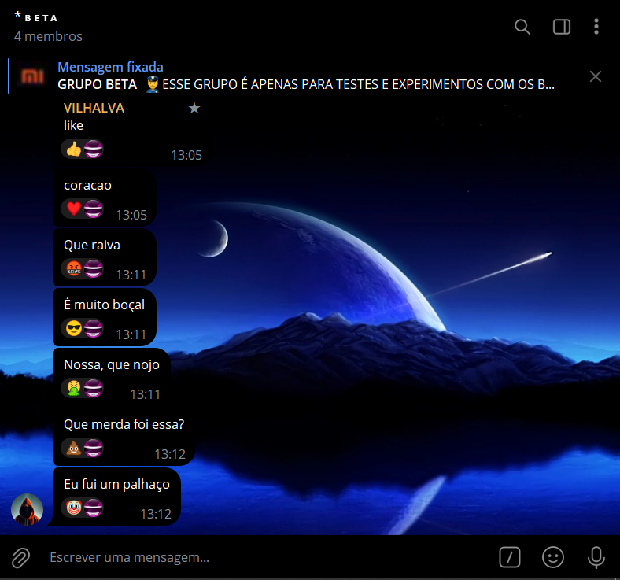
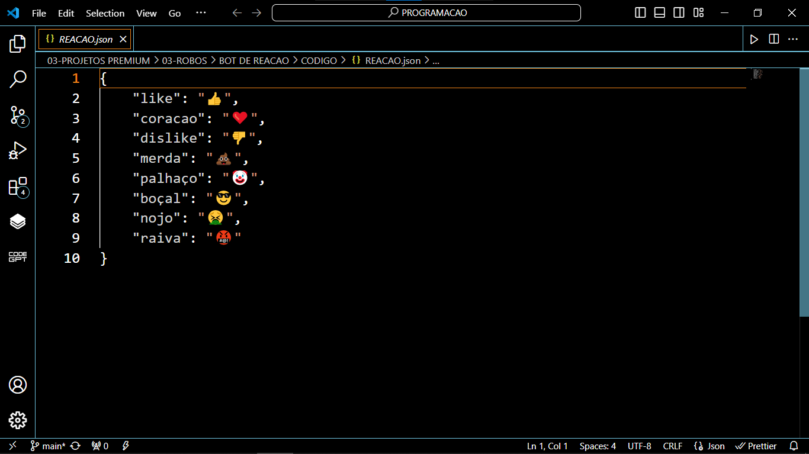

# BOT DE REACOES EM GRUPOS 02
🤖ESSE É UM BOT DO TELEGRAM QUE REAJE AUTOMATICAMENTE A UMA PALAVRA CHAVE EM UMA CONVERSA NO GRUPO!

  
  

## DESCRIÇÃO:
Este bot é um assistente automatizado para grupos do Telegram que reage a mensagens contendo palavras-chave específicas com emojis correspondentes. 

## FUNCIONALIDADES:
1. **Reações Automáticas:** O bot monitora todas as mensagens enviadas em grupos do Telegram em que ele está presente.
  
2. **Palavras-chave e Reações Correspondentes:** Ele procura por palavras-chave específicas dentro das mensagens. Quando uma palavra-chave é encontrada, o bot reage à mensagem com um emoji correspondente pré-definido.

3. **Configuração Flexível:** A lista de palavras-chave e reações correspondentes é configurável por meio de um arquivo JSON chamado "REACAO.json".

