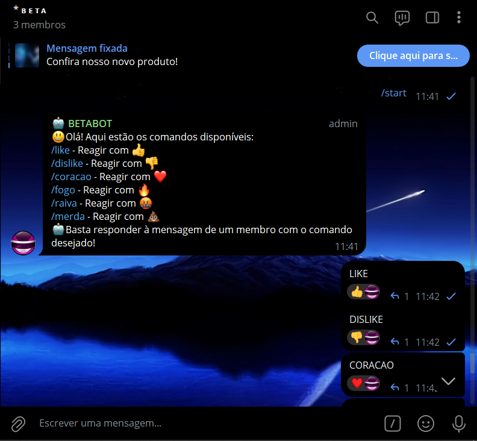
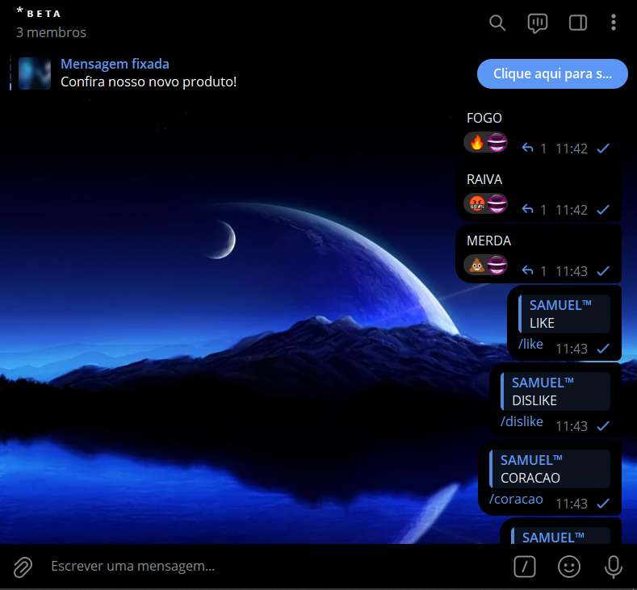
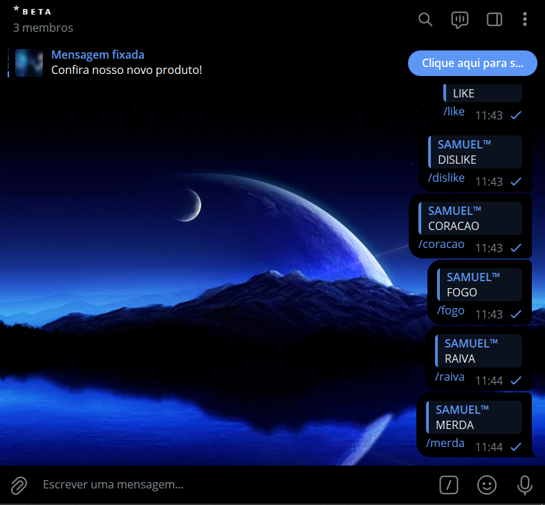
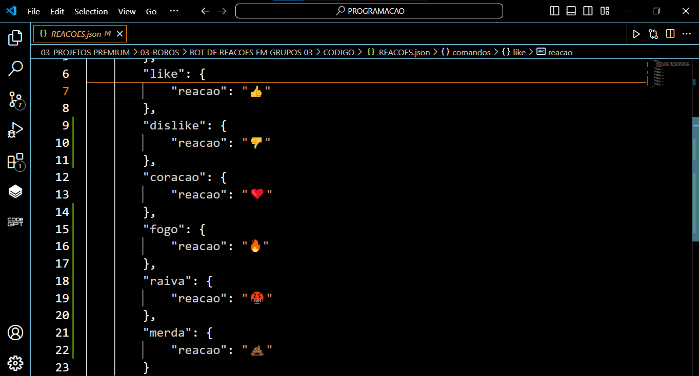

# BOT DE REACOES EM GRUPOS 03
🤖ESTE BOT TELEGRAM É PROJETADO PARA REAGIR A MENSAGENS COM EMOJIS BASEADOS EM COMANDOS DEFINIDOS PELO USUÁRIO.

  
  
  
  

## DESCRIÇÃO:
Este bot Telegram é projetado para reagir a mensagens com emojis baseados em comandos definidos pelo usuário. Ele permite uma fácil customização dos comandos e das reações através de um arquivo JSON (`REACOES.json`). O objetivo principal é fornecer uma interface simples para adicionar novos comandos e reações sem a necessidade de modificar o código principal do bot.

## FUNCIONALIDADES:
1. **Boas-vindas e Ajuda**: Envia uma mensagem de boas-vindas e uma lista de comandos disponíveis quando o usuário digita `/start`.
2. **Reações a Mensagens**: Permite que os usuários adicionem reações em forma de emojis a mensagens específicas ao usar comandos predefinidos, como `/like` para reagir com um polegar para cima e `/coracao` para reagir com um coração, etc. Para usar esse bot do Telegram, basta responder à mensagem de um membro com o comando desejado.
3. **Configuração Dinâmica**: Os comandos e as reações são carregados de um arquivo JSON, permitindo fácil atualização e expansão das funcionalidades do bot sem necessidade de alterar o código principal.

