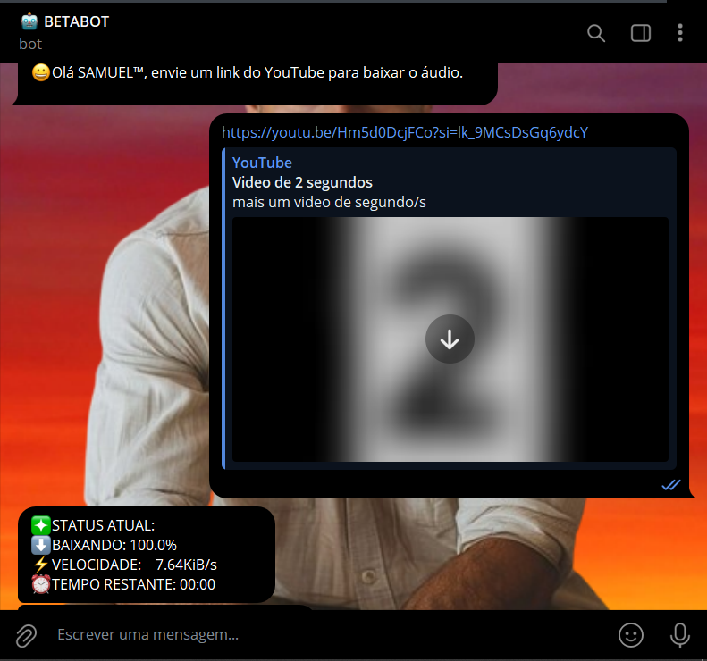
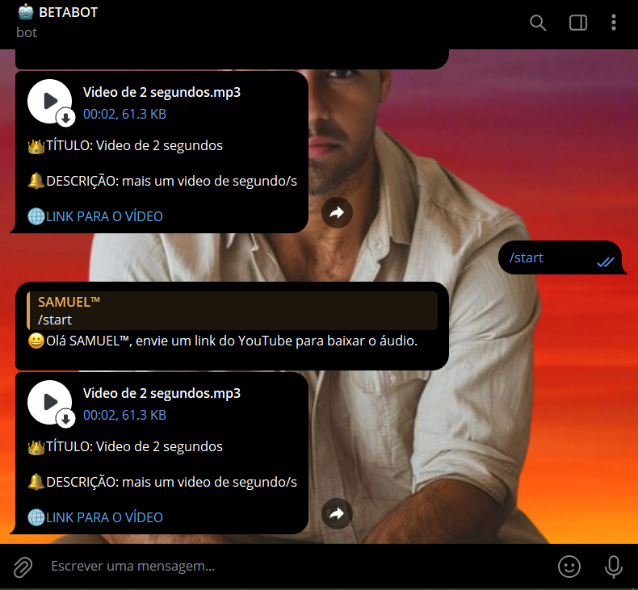
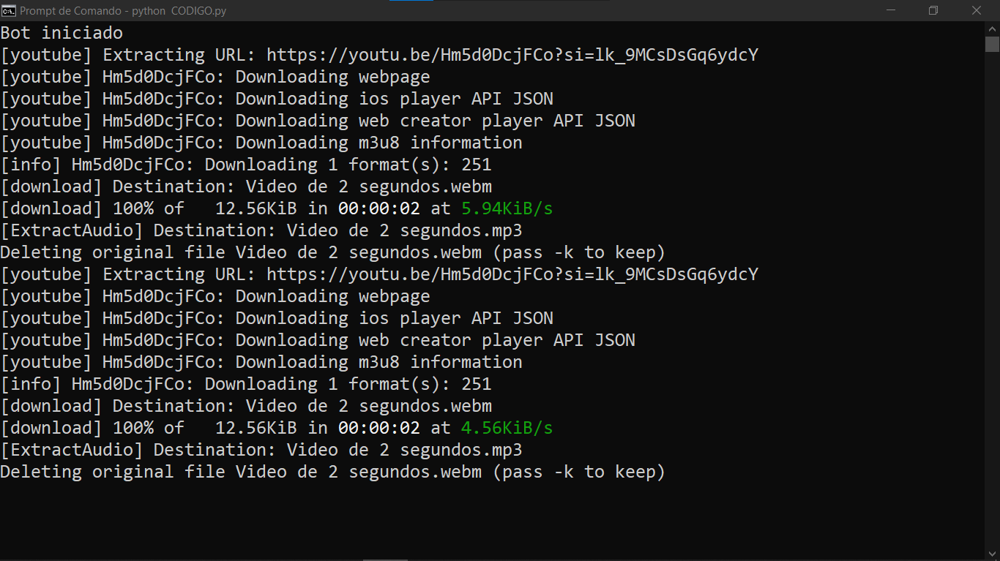

# BOT DOWNLOAD DE MP3
🤖ESSE É UM BOT DO TELEGRAM QUE BAIXA MÚSICAS DO YOUTUBE E CONVERTE PARA MP3.

  
  
  

## DESCRIÇÃO:
Este bot do Telegram é projetado para baixar e enviar áudio de vídeos do YouTube. As principais funcionalidades são:

1. **Recepção de Comandos de Início**:
   - Ao iniciar o bot com o comando `/start`, o bot envia uma mensagem de boas-vindas, orientando o usuário a enviar um link do YouTube para baixar o áudio.

2. **Processamento de Links do YouTube**:
   - O bot monitora mensagens de texto e, ao detectar um link do YouTube (`youtube.com` ou `youtu.be`), solicita ao usuário que escolha o formato de download.

3. **Escolha do Formato**:
   - Após o envio do link, o bot apresenta opções para o usuário escolher o formato desejado: **Áudio MP3** ou **Vídeo MP4**. O formato MP3 é o padrão para áudio.

4. **Download e Conversão do Áudio**:
   - O bot utiliza a biblioteca `yt-dlp` para baixar o áudio em formato MP3 com qualidade de 192 kbps. O título do vídeo do YouTube é usado como nome do arquivo MP3.

5. **Notificação de Progresso**:
   - Durante o processo de download, o bot envia atualizações em tempo real sobre o progresso, incluindo a porcentagem concluída, a velocidade de download e o tempo estimado restante. Mensagens antigas são removidas para manter o chat limpo.

6. **Envio do Áudio**:
   - Após o download e a conversão (se necessário), o bot envia o arquivo MP3 para o usuário com uma legenda informativa que inclui o título do vídeo, uma breve descrição e o link para o vídeo.

7. **Tratamento de Erros**:
   - Em caso de erro (como link inválido ou falha no download), o bot informa o usuário sobre o problema ocorrido e limpa mensagens antigas para manter o chat organizado.

8. **Limpeza do Chat**:
   - O bot remove mensagens antigas, incluindo a seleção de formato e o status de progresso, após a conclusão do download ou em caso de erro para manter o chat limpo e organizado.

