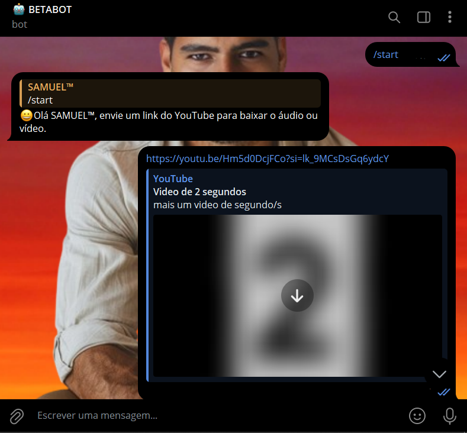
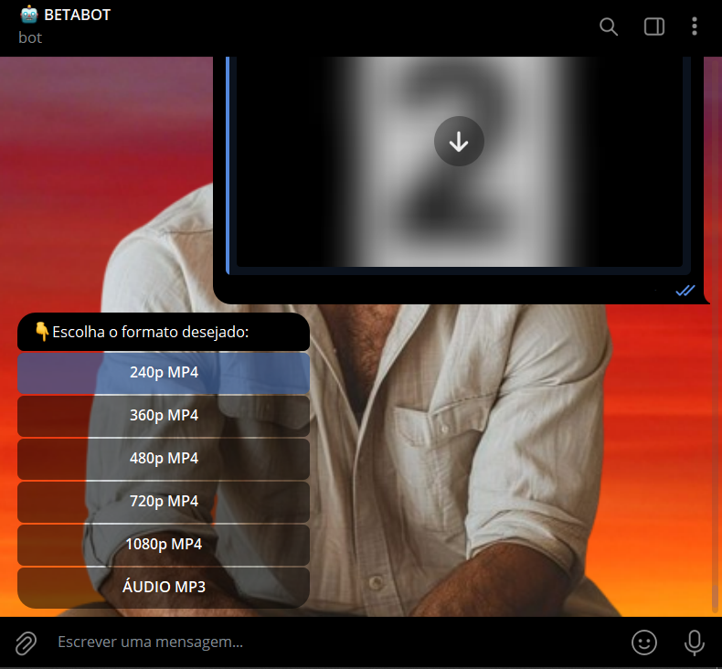
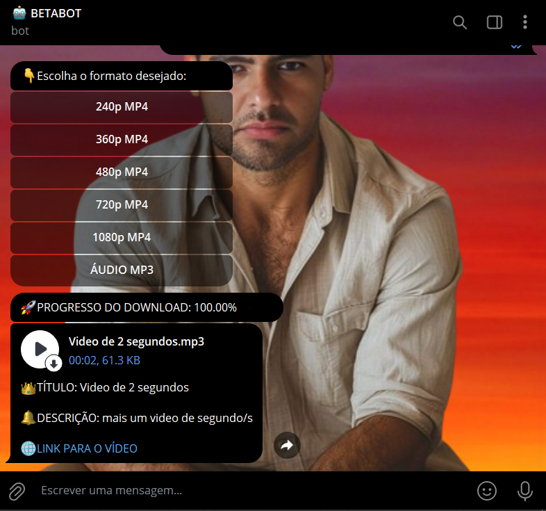
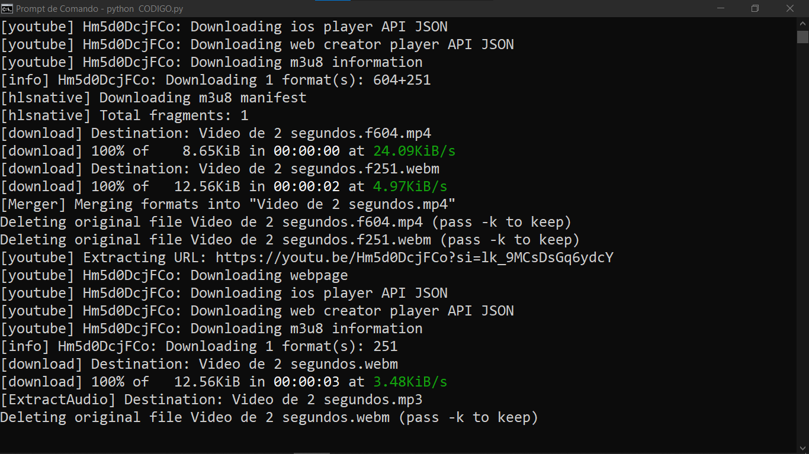

# BOT DOWNLOAD DE VIDEOS
🤖ESSE É UM BOT DO TELEGRAM QUE BAIXA VIDEOS E MÚSICAS DO YOUTUBE.

  
  
  
  
  

## DESCRIÇÃO:
Esse bot é um **baixador de vídeos e áudios do YouTube** que utiliza o Telegram como interface. Ele permite que o usuário escolha entre baixar o **áudio** (formato MP3) ou o **vídeo** (formato MP4) de um link do YouTube, e acompanha o processo de download informando o progresso em tempo real através de mensagens no chat.

## FUNCIONALIDADES:
1. **Escolha do formato**: O bot oferece a opção de baixar o conteúdo do YouTube como áudio (MP3) ou vídeo (MP4).
2. **Atualização em tempo real**: Durante o download, o bot atualiza o usuário sobre o progresso (percentual baixado) na mesma mensagem, removendo a mensagem anterior do progresso uma vez que o arquivo é enviado ou em caso de erro.
3. **Entrega do arquivo**: Após o download e, quando necessário, a conversão, o arquivo é enviado diretamente no chat do Telegram com uma legenda informativa que inclui o título do vídeo, uma breve descrição e o link do vídeo.
4. **Limpeza do chat**: Mensagens antigas, como a seleção de formato e o progresso do download, são removidas para manter o chat limpo e organizado.

