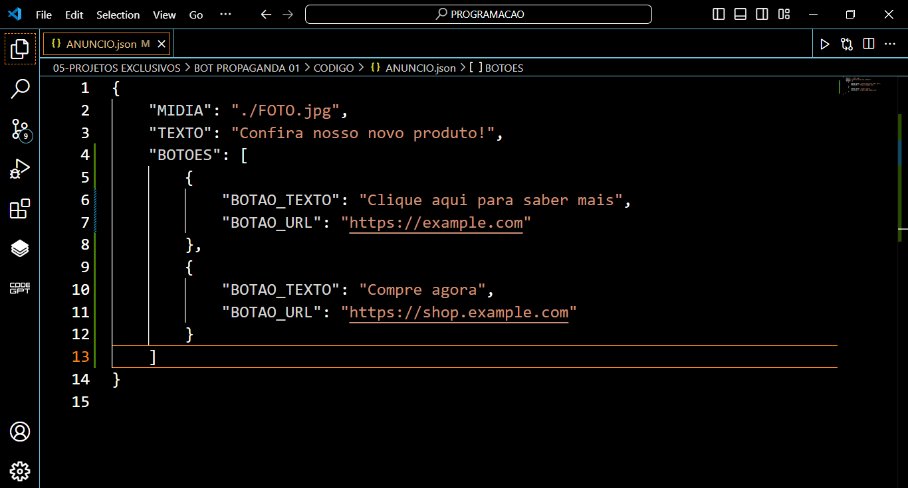
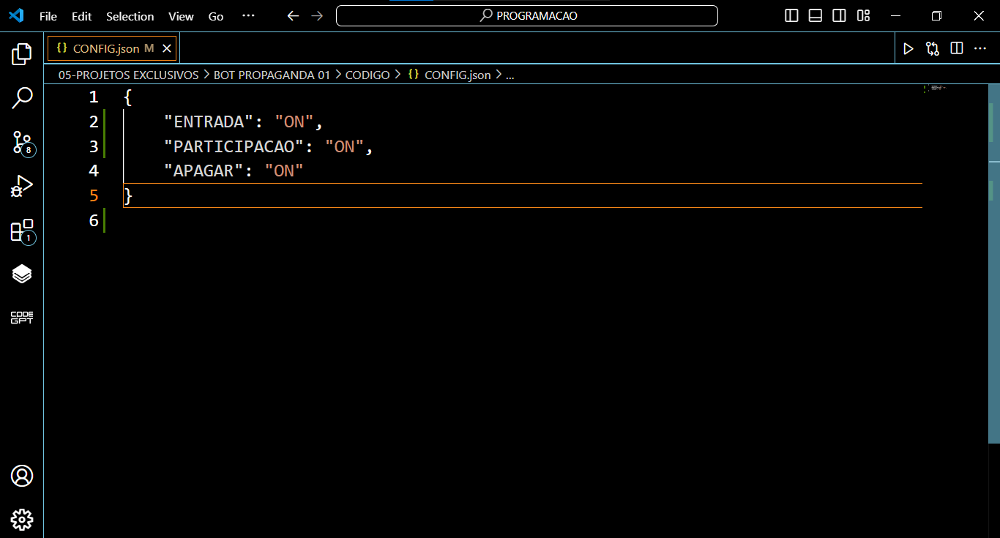

# BOT PROPAGANDA 01
🤖ESSE É UM BOT DO TELEGRAM QUE ENVIA UM ÁNUNCIO SEMPRE QUE UM MEMBRO DO GRUPO ENTRA E/OU ENVIA UMA MENSAGEM!

  
  
  
  

## DESCRIÇÃO:
Este bot de Telegram é projetado para automatizar o envio de anúncios em grupos de Telegram. Ele oferece algumas funcionalidades específicas baseadas nas interações dos membros com o grupo, permitindo que os administradores configurem como e quando os anúncios devem ser enviados.

## FUNCIONALIDADES:
1. **Anúncio na Entrada de Novos Membros**:
   - Quando um novo membro entra no grupo, o bot pode ser configurado para enviar automaticamente um anúncio como resposta à mensagem de serviço do Telegram que informa que o novo membro entrou. Esse anúncio pode incluir texto, mídia (como imagens), e botões interativos com links.
   - A configuração para ativar ou desativar essa funcionalidade está no arquivo `CONFIG.json` sob a chave `"ENTRADA"`. Quando `"ENTRADA": "ON"`, o bot enviará o anúncio na entrada de novos membros.

2. **Anúncio na Participação de Membros**:
   - O bot pode ser configurado para enviar anúncios automaticamente quando um membro envia uma mensagem no grupo (exceto quando o remetente é outro bot). Ele responde diretamente à mensagem do usuário, permitindo que o anúncio seja contextualizado como uma resposta à participação.
   - Esta funcionalidade é controlada pela chave `"PARTICIPACAO"` no arquivo `CONFIG.json`. Quando `"PARTICIPACAO": "ON"`, o bot enviará o anúncio em resposta à participação dos membros.

3. **Apagar Anúncios Anteriores**:
   - Para evitar que o grupo fique cheio de anúncios repetidos, o bot pode apagar automaticamente o anúncio anterior antes de enviar um novo. Isso se aplica tanto aos anúncios enviados na entrada de novos membros quanto aos enviados na participação de membros.
   - Esta função é ativada pela configuração `"APAGAR": "ON"` no `CONFIG.json`. Se ativada, sempre que um novo anúncio for enviado, o bot apagará o último anúncio postado no grupo.

4. **Configurações de Anúncios**:
   - Os anúncios que o bot envia são definidos em um arquivo `ANUNCIO.json`. Este arquivo pode conter:
     - **Texto**: O conteúdo textual do anúncio.
     - **Mídia**: O caminho para um arquivo de mídia (por exemplo, uma imagem) que será enviado com o anúncio.
     - **Botões**: Botões interativos que podem ser incluídos no anúncio, cada um com um texto e um URL.

