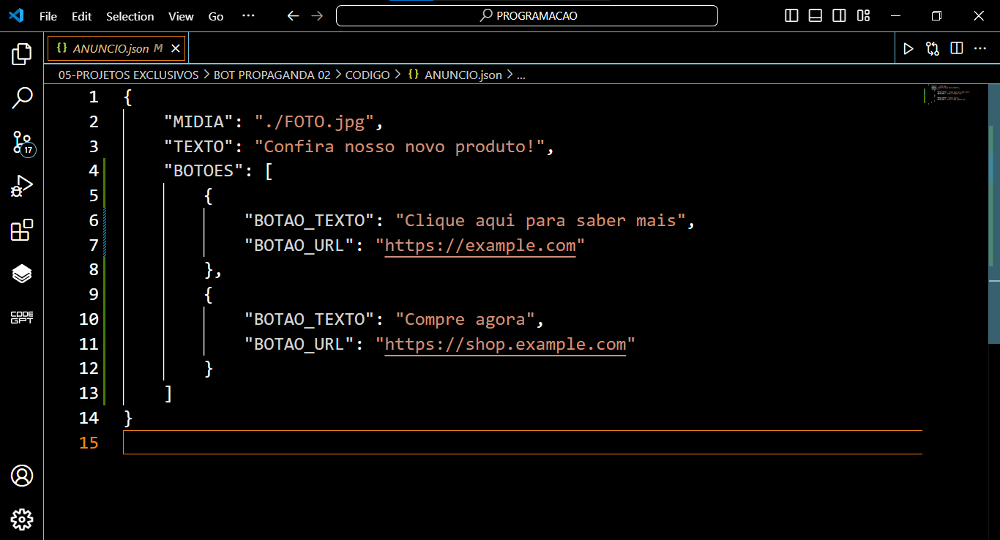
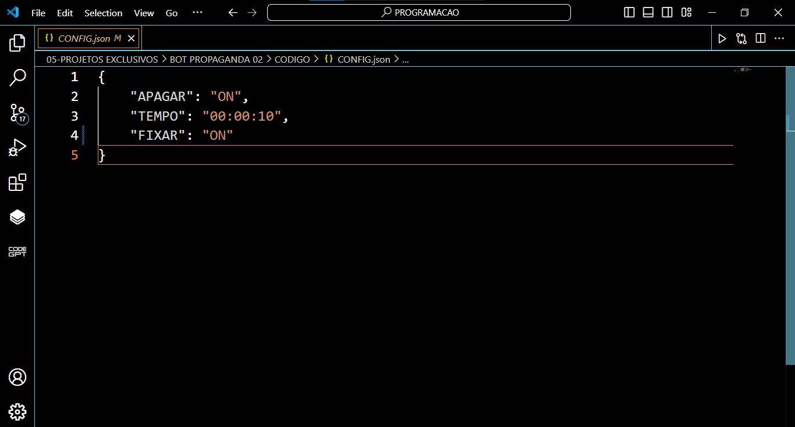

# BOT PROPAGANDA 02
🤖ESSE É UM BOT DO TELEGRAM QUE ENVIA UM ÁNUCIO DE TEMPOS EM TEMPOS!

  
  
  

## DESCRIÇÃO:
Este bot é um bot de anúncios automatizado para grupos do Telegram. Ele é capaz de enviar anúncios periodicamente de acordo com as configurações definidas no arquivo "CONFIG.json". 

O bot utiliza dois arquivos JSON para suas configurações: "CONFIG.json" e "ANUNCIO.json". No arquivo "CONFIG.json", o administrador do grupo pode configurar opções como se deseja apagar o anúncio anterior antes de enviar um novo, o intervalo de tempo entre os anúncios e se o anúncio deve ser fixado no topo do grupo. No arquivo "ANUNCIO.json", o administrador pode definir o conteúdo do anúncio, incluindo texto, mídia (foto) e texto com botões de URLs.

