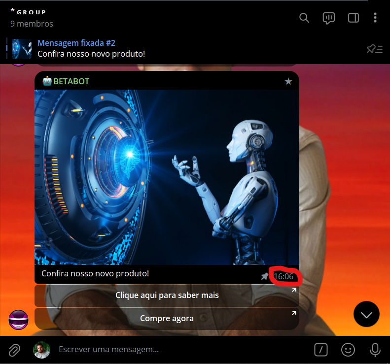
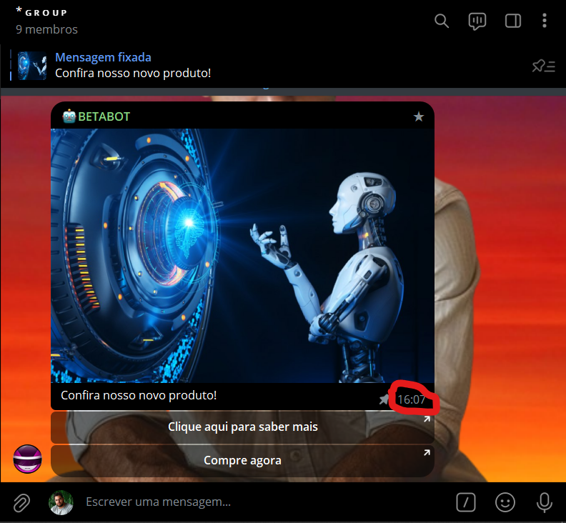
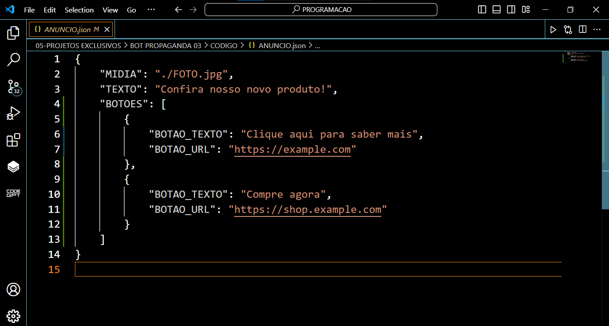
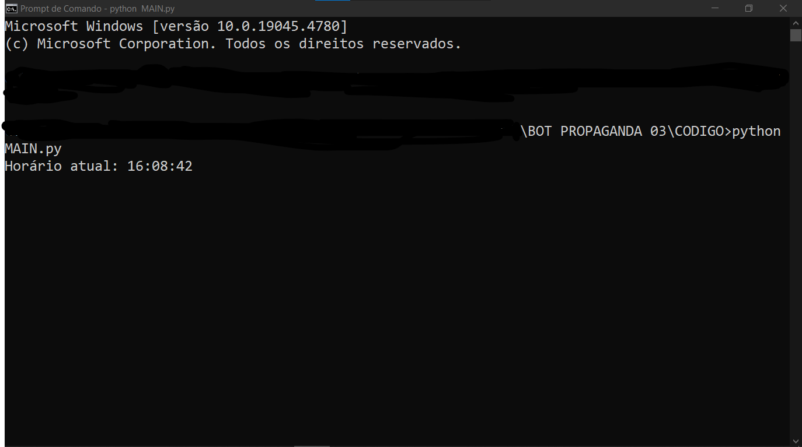

# BOT PROPAGANDA 03
🤖ESSE É UM BOT DO TELEGRAM QUE ENVIA UM ÁNUNCIO NOS HORÁRIOS PROGRAMADOS!

  
  
  
  
  

## DESCRIÇÃO:
Este bot é um bot de anúncios automatizado para grupos do Telegram. Ele é projetado para enviar anúncios nos horários especificados pelo dono no arquivo "CONFIG.json".

O bot opera verificando constantemente o horário atual e comparando-o com os horários programados no arquivo de configuração. Quando o horário atual corresponde a um dos horários programados, o bot envia o anúncio para o grupo especificado.

O arquivo "CONFIG.json" contém as configurações do bot, incluindo se o anúncio anterior deve ser apagado antes de enviar um novo, os horários programados para enviar os anúncios e se o anúncio deve ser fixado no topo do grupo. No arquivo "ANUNCIO.json", o administrador pode definir o conteúdo do anúncio, incluindo texto, mídia (foto) e texto com botões de URLs.

