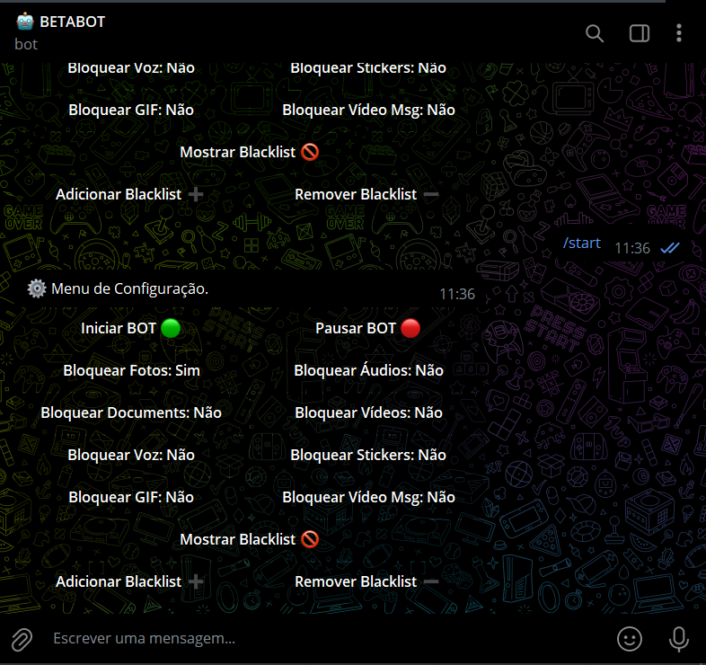
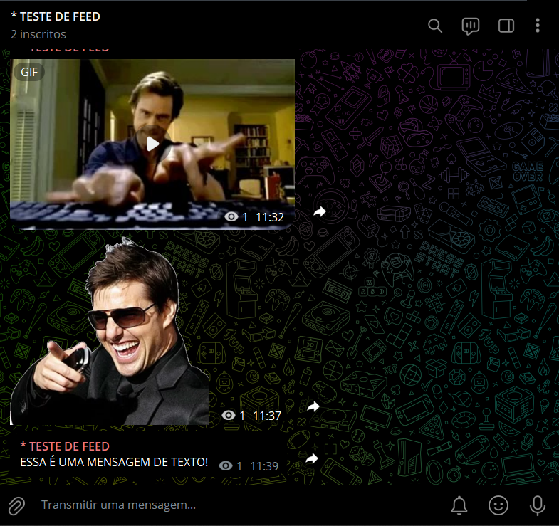
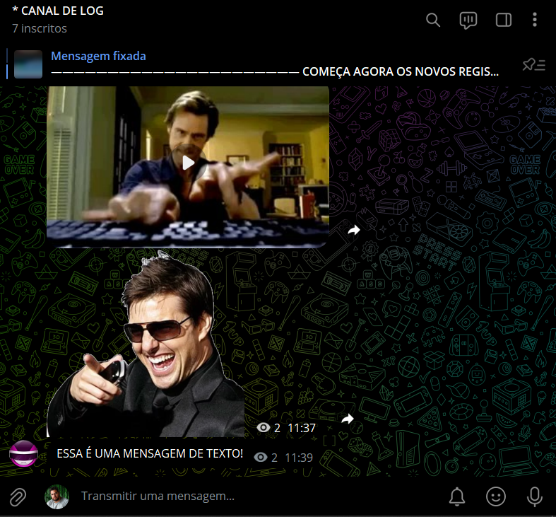

# BOT REPASSE ENTRE CANAIS
🤖É UM BOT DE ENCAMINHAMENTO DE MENSAGENS ENTRE CHATS NO TELEGRAM.

  
  
  

## DESCRIÇÃO:
Este bot em Python, utilizando a biblioteca Pyrogram, é um **bot de encaminhamento de mensagens** entre chats no Telegram. Ele pode **encaminhar, editar e deletar mensagens** de chats de origem para chats de destino. 

## FUNCIONALIDADES:
1. **Encaminhamento de mensagens**: O bot pode encaminhar mensagens de um chat de origem para vários chats de destino, substituindo palavras com base em uma lista de substituições.
2. **Filtragem de mídia**: Ele bloqueia ou permite diferentes tipos de mídia (fotos, vídeos, documentos, etc.), conforme configurado.
3. **Blacklist de palavras**: Possui uma blacklist que bloqueia mensagens que contenham determinadas palavras.
4. **Substituição de palavras**: O bot substitui palavras em mensagens com base em uma lista de substituições definida pelo administrador.
5. **Edição e exclusão de mensagens**: Se a mensagem original for editada ou excluída no chat de origem, as mensagens encaminhadas também serão editadas ou deletadas nos chats de destino.
6. **Configuração via Menu**: Um menu interativo permite aos administradores do bot controlarem o status do bot, ativar ou desativar tipos de mídia, e gerenciar a blacklist.

## COMANDOS E INTERAÇÕES:
- **Iniciar e Pausar o bot**: O bot pode ser pausado ou iniciado por um administrador.
- **Controle de mídia**: Há botões de configuração para bloquear ou permitir fotos, áudios, documentos, vídeos, entre outros.
- **Gestão da Blacklist**: Administradores podem adicionar ou remover palavras da blacklist.
- **Controle via Menu**: O bot apresenta um menu de controle que é acessível pelos administradores.

## SEU USO:
1. **Administração**:
   - Admins podem usar comandos como `/start` para acessar o menu de configuração e controlar as funções do bot.
   - Administradores também podem modificar o comportamento do bot com opções de ativar/pausar e gerenciar mídia bloqueada ou a blacklist.

2. **Encaminhamento de Mensagens**:
   - Toda vez que uma mensagem é enviada no chat de origem, o bot verifica se ela está de acordo com as regras de bloqueio e encaminha a mensagem para os chats de destino.
   - Se uma mensagem for editada ou excluída no chat de origem, o bot também atualiza ou remove as mensagens encaminhadas.

3. **Interações de Usuário**:
   - Usuários podem interagir com o bot via mensagens privadas, mas funcionalidades avançadas são restritas a administradores, e mensagens de boas-vindas explicam as funções básicas.

## PERSONALIZAÇÕES:
- **Configurações de mídia bloqueada**: O bot pode ser configurado para bloquear certos tipos de mídia como fotos, vídeos, áudios, etc.
- **Substituições de palavras**: O bot permite que palavras em mensagens sejam automaticamente substituídas por outras definidas pelo administrador.
- **Blacklist**: O bot bloqueia mensagens que contenham palavras indesejadas, que podem ser gerenciadas via o menu de administração.

