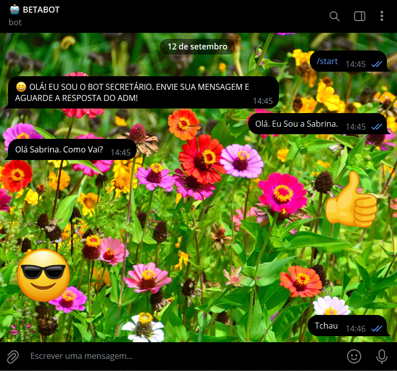
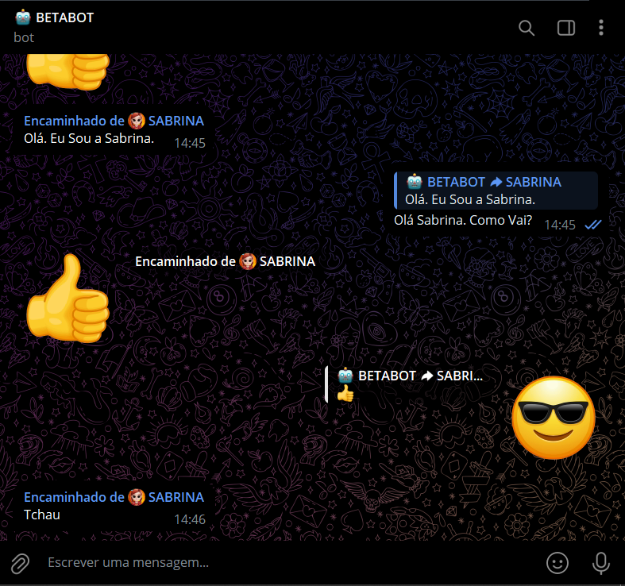
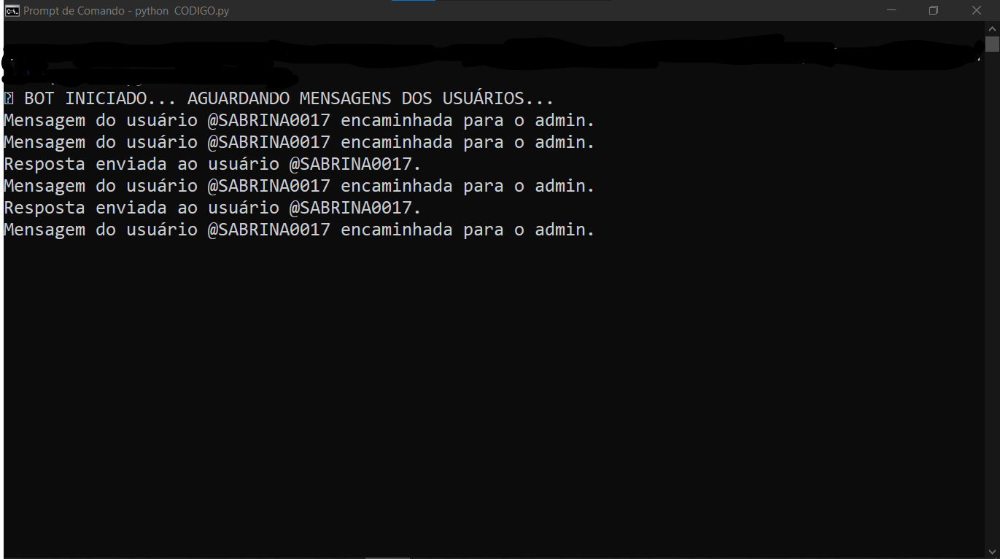

# BOT SECRETARIO 01
🤖É UM BOT SIMPLES DO TELEGRAM PROJETADO PARA FUNCIONAR COMO UM INTERMEDIÁRIO ENTRE USUÁRIOS E UM ADMINISTRADOR.

  
  
  

## DESCRIÇÃO:
O **BOT SECRETARIO 01** é um bot do Telegram projetado para funcionar como um intermediário entre um usuário e um administrador. Ele tem as seguintes funcionalidades:

1. **Recepção de Mensagens de Usuários**:
   - O bot escuta e recebe mensagens enviadas por usuários que não sejam o administrador.

2. **Encaminhamento de Mensagens para o Administrador**:
   - Quando um usuário envia uma mensagem, o bot encaminha essa mensagem para o administrador do bot. As mensagens são encaminhadas no formato de citação, preservando o conteúdo original.

3. **Respostas do Administrador**:
   - O administrador pode responder às mensagens dos usuários. O bot verifica se a resposta do administrador está citando a mensagem original (usando a funcionalidade de "responder" do Telegram).
   - Se a resposta estiver citando uma mensagem original, o bot envia essa resposta ao usuário original.
   - Se a resposta do administrador não estiver citando uma mensagem original, o bot a envia de volta ao próprio administrador (funcionalidade de "eco").

4. **Mensagens de Boas-Vindas**:
   - Quando um usuário inicia uma conversa com o bot enviando o comando `/start`, o bot responde com uma mensagem de boas-vindas.

