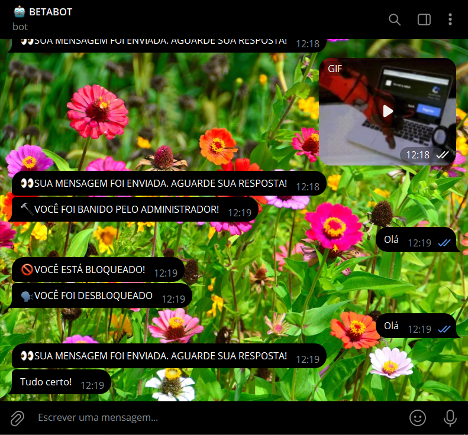
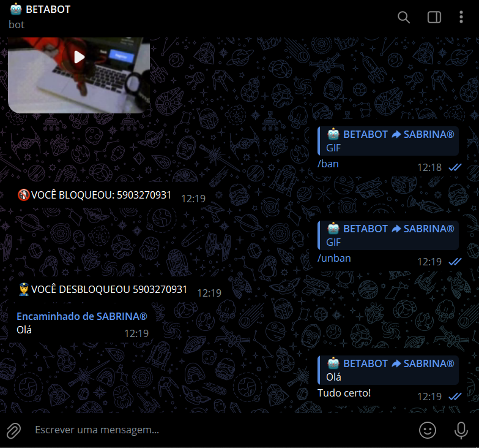

# BOT SECRETARIO 02
🤖É UM BOT MAIS COMPLEXO DO TELEGRAM PROJETADO PARA FUNCIONAR COMO UM INTERMEDIÁRIO ENTRE USUÁRIOS E UM ADMINISTRADOR.

  
  

## DESCRIÇÃO:
- O **BOT SECRETARIO 02** é um bot do Telegram projetado para funcionar como um intermediário entre um usuário e um administrador.

- Esse Bot gerencia usuários adicionando-os ao banco de dados e permitindo ao administrador bloqueá-los ou desbloqueá-los, encaminha mensagens recebidas para o administrador preservando o conteúdo original e permite que o administrador responda ou faça eco das mensagens, além de possibilitar o envio de mensagens de broadcast para todos os usuários e lidar com diversos tipos de conteúdo como fotos e vídeos, fornecendo respostas padrão quando necessário.

## FUNCIONALIDADES:
1. **Gerenciamento de Usuários**:
   - **Adicionar Usuários**: Quando um usuário inicia uma conversa com o bot, ele é adicionado ao banco de dados.
   - **Bloquear/Desbloquear Usuários**: O administrador pode bloquear ou desbloquear usuários específicos, impedindo ou permitindo que eles enviem mensagens.

2. **Encaminhamento e Resposta de Mensagens**:
   - **Encaminhamento**: Mensagens enviadas por usuários são encaminhadas para o administrador com o conteúdo original preservado.
   - **Resposta com Citação**: O administrador pode responder a mensagens dos usuários. Se a resposta for uma citação, o bot a envia ao usuário original. Caso contrário, o bot faz um eco da mensagem para o administrador.

3. **Mensagens de Broadcast**:
   - **Envio para Todos**: O administrador pode enviar mensagens para todos os usuários registrados no banco de dados.

4. **Reação a Conteúdos Diversos**:
   - O bot lida com diferentes tipos de mensagens, como fotos, vídeos e documentos, encaminhando-os ou enviando uma resposta padrão quando o usuário é bloqueado.

