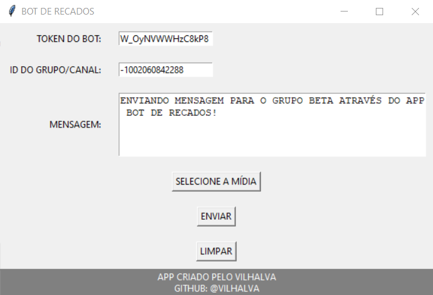
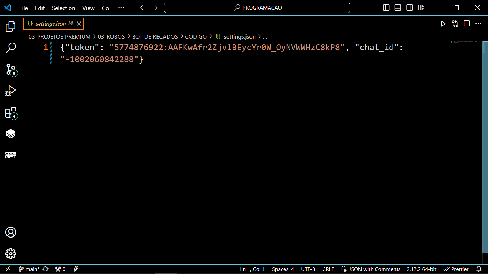

# BROADCAST 01
🤖ENVIE SEUS RECADOS PARA SEU GRUPO OU CANAL VIA BOT DO TELEGRAM.

  
  
  

## DESCRIÇÃO:
Esse é um aplicativo desenvolvido em Python utilizando a biblioteca gráfica Tkinter e a biblioteca de bot do Telegram, chamada Telebot. Este bot oferece uma interface gráfica simples e intuitiva para os usuários enviarem mensagens ou mídias para grupos ou canais no Telegram de forma rápida e eficiente.

## FUNCIONALIDADES:
1. **Envio de Mensagens:**
   - O bot permite que os usuários ingressem o token do bot, o ID do grupo/canal de destino e a mensagem que desejam enviar.
   - O campo de mensagem é um widget de texto que permite a inserção de mensagens mais longas e formatadas.

2. **Envio de Mídias:**
   - Os usuários podem enviar mídias, como imagens ou vídeos, selecionando o arquivo desejado por meio de um botão de seleção de mídia.
   - Se uma mensagem de texto for inserida junto com uma mídia, a mensagem será usada como legenda para a mídia.

3. **Persistência de Configurações:**
   - O bot salva automaticamente o token do bot e o ID do grupo/canal em um arquivo de configuração (settings.json).
   - Ao reiniciar o bot, as informações salvas são carregadas nos campos correspondentes, proporcionando uma experiência contínua para o usuário.

4. **Feedback Visual:**
   - O bot fornece feedback visual por meio de caixas de mensagem informativas e de alerta.
   - Mensagens de sucesso, erros ou avisos são exibidas em caixas de diálogo pop-up.

5. **Facilidade de Uso:**
   - A interface gráfica foi projetada de forma simples e organizada, facilitando a compreensão e utilização por usuários de diferentes níveis de experiência.

