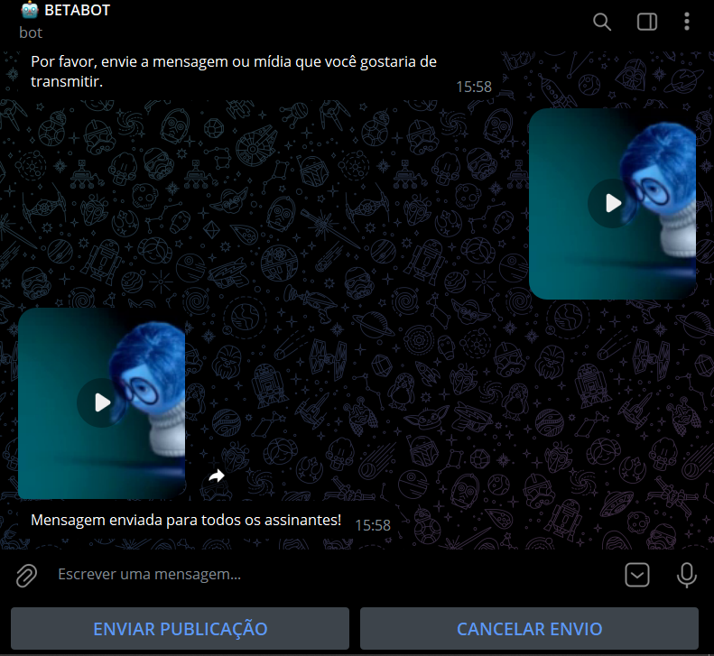
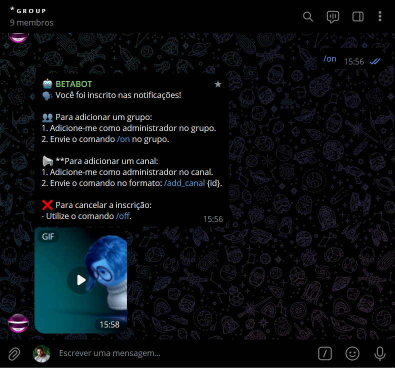

# BROADCAST 02
🤖ENVIE SUAS PUBLICAÇÕES PARA TODOS OS INSCRITOS NO SEU BOT DO TELEGRAM.

  
  
  
  
  

## DESCRIÇÃO:
- Um bot do Telegram para enviar mensagens e mídias aos assinantes diretamente pelo bot.

- Este bot do Telegram gerencia a lista de assinantes, permitindo que um admin envie e cancele o envio de mensagens e mídias para todos os assinantes, com a lista de IDs armazenada no arquivo `subscribers.json`.

## FUNCIONALIDADES:
1. **Gerenciamento de Assinantes**:
   - **Adicionar Assinantes**: Adiciona o usuário que inicia uma conversa com o bot à lista de assinantes.
   - **Remover Assinantes**: Permite que um usuário cancele a inscrição, removendo-o da lista de assinantes.
   - **Adicionar Canal**: Permite que um canal seja adicionado à lista de assinantes se o usuário fornecer um ID válido.

2. **Administração**:
   - **Administração**: Um usuário com ID de admin (definido na variável de ambiente `ADMIN_ID`) pode enviar mensagens ou mídias para todos os assinantes.
   - **Cancelar Envio**: O admin pode cancelar o envio de uma publicação se a operação ainda estiver aguardando.

3. **Tipos de Mídia**
   - Quando o admin envia uma mensagem, foto, vídeo, sticker ou animação, o bot encaminha essa mídia para todos os assinantes. 

4. **Arquivos Utilizados:**
   - **`subscribers.json`**: Armazena a lista de IDs de assinantes. Adiciona e remove assinantes conforme necessário.

## COMANDOS:
1. **Comando `/on`**:
   - Enviado por qualquer usuário que deseja se inscrever nas notificações.

2. **Comando `/off`**:
   - Enviado por qualquer usuário que deseja cancelar a inscrição.

3. **Comando `/add_canal {id}`**:
   - Enviado por qualquer usuário (idealmente um admin) para adicionar um canal à lista de assinantes. `{id}` deve ser substituído pelo ID do canal.

4. **Opção "ENVIAR PUBLICAÇÃO"**:
   - Disponível apenas para o admin. O admin pode enviar uma mensagem ou mídia para todos os assinantes após selecionar esta opção.

5. **Opção "CANCELAR ENVIO"**:
   - Disponível apenas para o admin. Permite cancelar o envio de uma publicação se o admin decidir interromper o processo.

