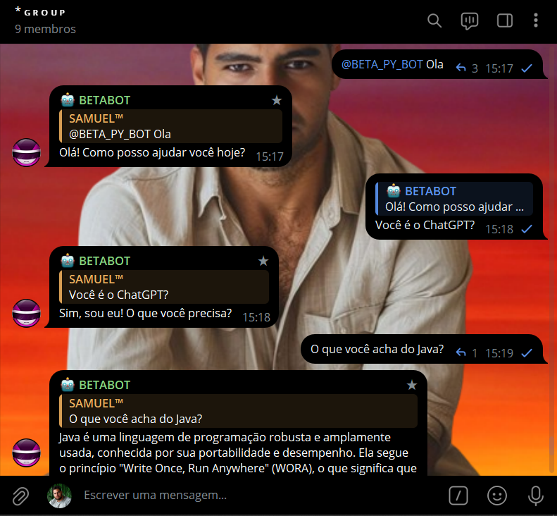
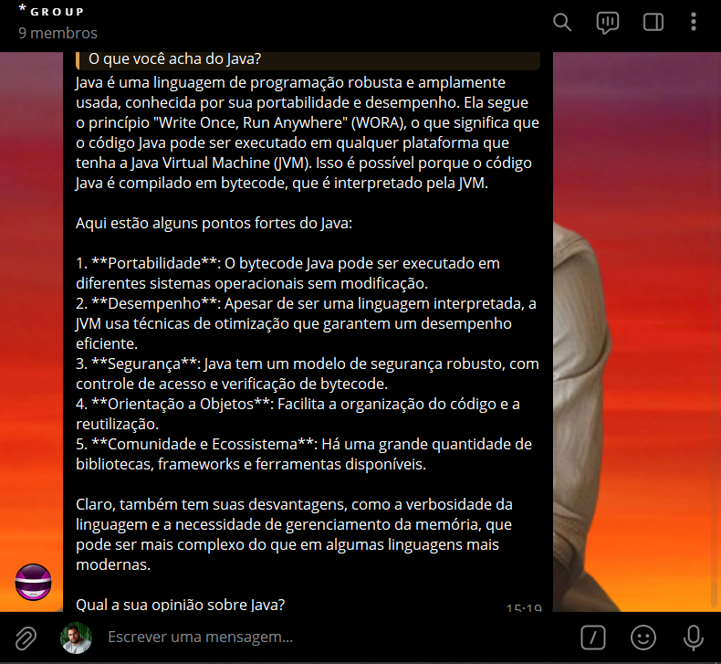
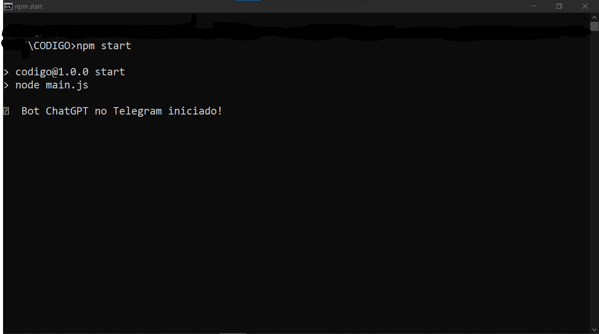

# CHATGPT NO TELEGRAM
🤖ESTE BOT DO TELEGRAM UTILIZA A API DO OPENAI PARA RESPONDER A MENSAGENS COM A INTELIGÊNCIA ARTIFICIAL DO CHATGPT.

  
  
  

## DESCRIÇÃO:
Este bot do Telegram utiliza a API do OpenAI para responder a mensagens com a inteligência artificial do ChatGPT. Ele pode operar tanto em chats privados (mensagens diretas) quanto em grupos, oferecendo uma interação automatizada e inteligente com os usuários.

## FUNCIONALIDADES:
1. **Resposta a Menções e Mensagens Diretas:**
   - **Em Grupos:** O bot responde a mensagens em grupos quando é mencionado. A menção deve ser feita com o nome de usuário do bot (por exemplo, `@nome_do_bot`).
   - **Em Mensagens Diretas:** O bot responde a todas as mensagens enviadas diretamente para ele (em mensagens privadas).

2. **Processamento de Mensagens:**
   - Quando o bot é mencionado em um grupo ou recebe uma mensagem direta, ele processa a mensagem recebida e faz uma chamada à API do OpenAI para obter uma resposta gerada pela IA.

3. **Resposta da API:**
   - O bot consulta a API do OpenAI (ChatGPT) e responde com o texto gerado pela IA.
   - Em caso de erro ao consultar a API (como exceder o limite de solicitações), o bot enviará uma mensagem de erro.

