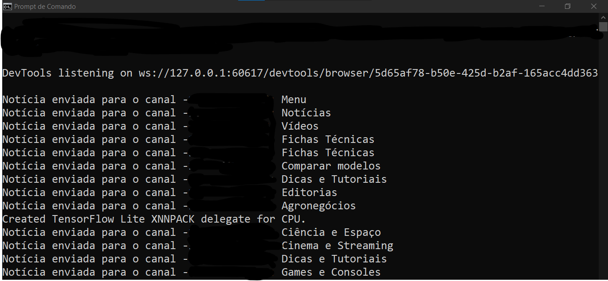

# FEED COM SELENIUM
🤖ESSE BOT AUTOMATIZA A CAPTURA DE NOTÍCIAS DE SITES DA WEB E AS ENVIA PARA CANAIS OU GRUPOS ESPECÍFICOS NO TELEGRAM.

  
  

## DESCRIÇÃO:
Esse bot automatiza a captura de notícias de sites da web e as envia para canais ou grupos específicos no Telegram. Ele utiliza o **Selenium** para navegar em sites de notícias e o **BeautifulSoup** para extrair o conteúdo HTML das páginas, além da API do Telegram para enviar as notícias diretamente para o chat.

## FUNCIONALIDADES:
1. **Busca de Notícias**:
   - O bot usa o Selenium para abrir sites que estão listados em um arquivo `SITES.txt`.
   - Para cada site, ele baixa o conteúdo da página e usa o BeautifulSoup para extrair links de notícias e seus títulos.
   - Ele armazena esses títulos e links em uma lista para posterior envio.

2. **Envio para o Telegram**:
   - Usando a API do Telegram via `telebot`, o bot envia as notícias para os IDs de chat especificados no arquivo `DADOS.py` (no campo `CHAT_ID`).
   - A mensagem contém o título da notícia e um link "Leia mais" para o usuário clicar.
   - O envio é feito de forma controlada com pequenos intervalos aleatórios para evitar bloqueios por spam.

3. **Ciclo Automático**:
   - O bot repete o processo automaticamente a cada 60 segundos, buscando novas notícias e enviando-as ao Telegram.

