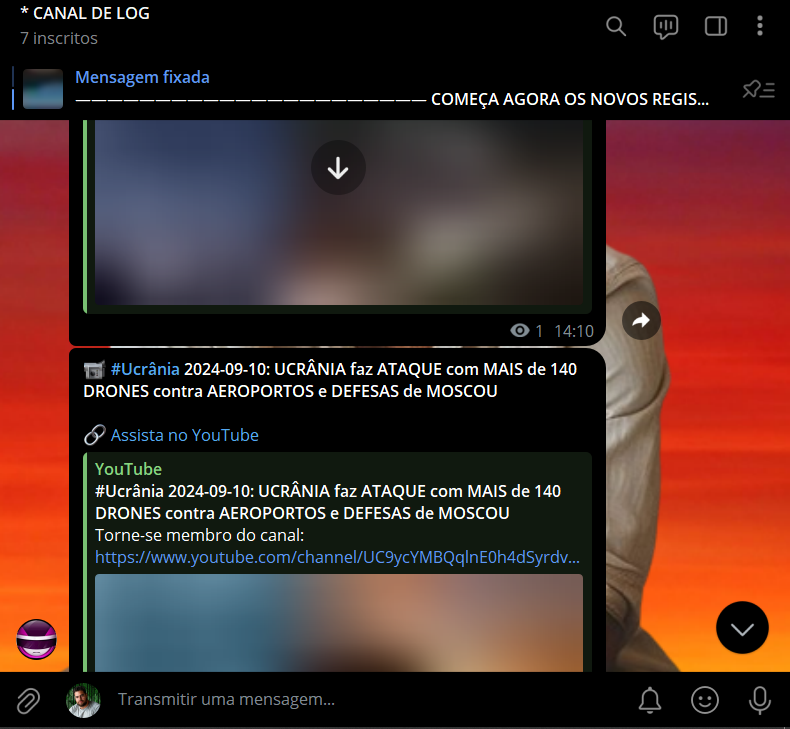
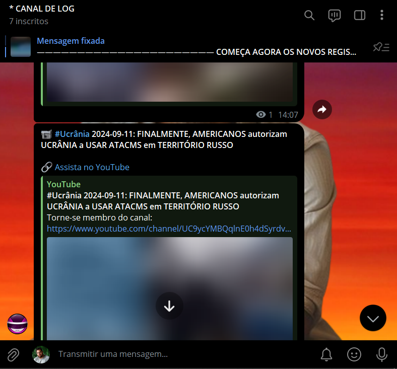
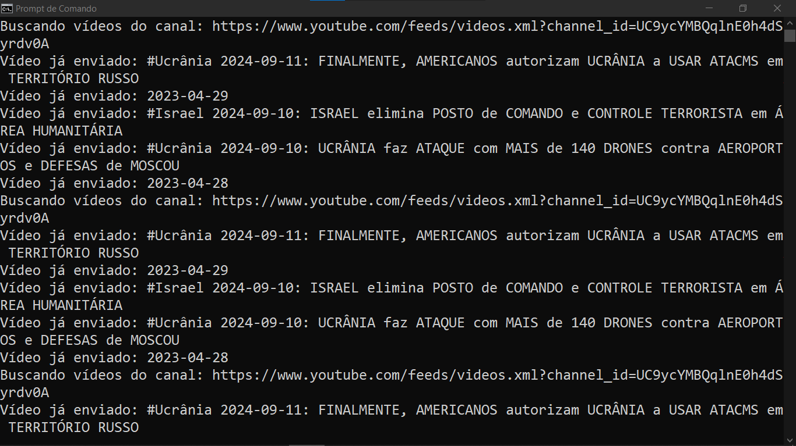
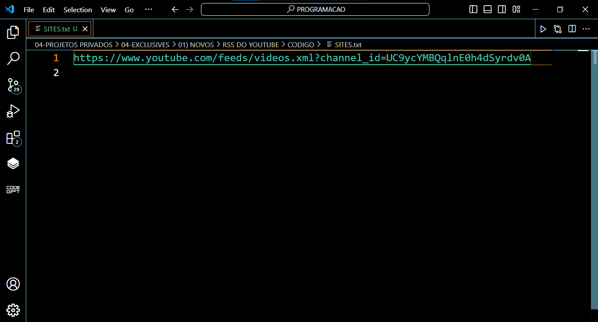

# RSS DO YOUTUBE
🤖BOT QUE BUSCA VÍDEOS MAIS RECENTES DE CANAIS DO YOUTUBE ATRAVÉS DE FEEDS RSS E ENVIÁ-LOS AUTOMATICAMENTE PARA UM OU MAIS CANAIS DO TELEGRAM!

  
  
  
  

## DESCRIÇÃO:
Este bot foi criado para buscar vídeos mais recentes de canais do YouTube através de feeds RSS e enviá-los automaticamente para um ou mais canais do Telegram. Ele verifica os vídeos mais recentes de cada canal do YouTube listado, e evita enviar vídeos duplicados utilizando um sistema de rastreamento de IDs de vídeos previamente enviados.

## FUNCIONALIDADES:
1. **Busca de vídeos no YouTube via RSS:** O bot utiliza o feed RSS de cada canal do YouTube para buscar os vídeos mais recentes (limitado aos 5 mais recentes por consulta).
2. **Envio para canais do Telegram:** Após buscar os vídeos, o bot envia cada um deles para um ou mais canais do Telegram configurados.
3. **Evita duplicações:** O bot armazena os IDs dos vídeos enviados em um arquivo (`enviados.txt`), garantindo que vídeos repetidos não sejam reenviados.
4. **Atualizações automáticas:** Ele verifica os canais periodicamente (a cada 10 minutos) para novos vídeos.

