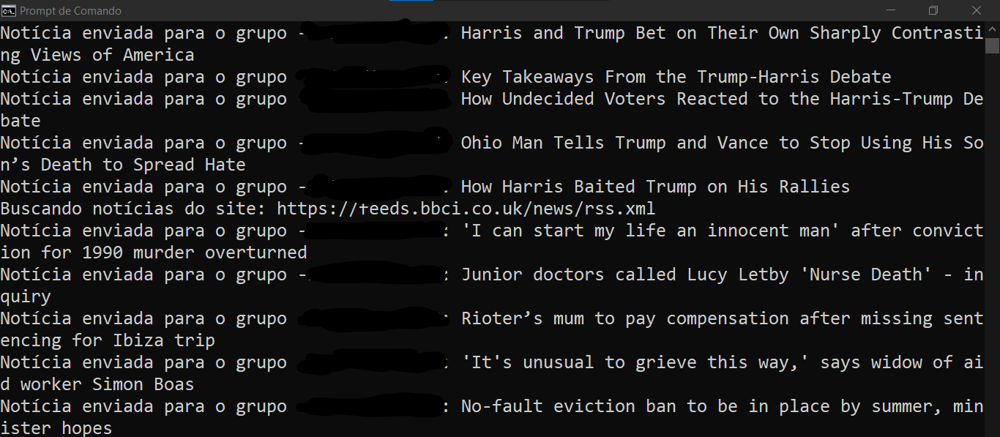
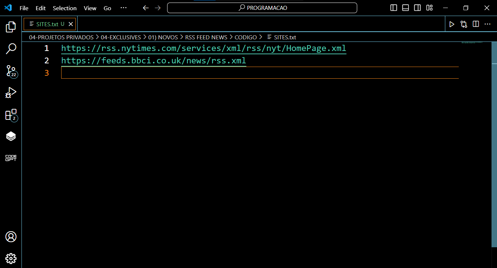

# RSS FEED NEWS
🤖BOT DO TELEGRAM QUE BUSCA NOTÍCIAS DE SITES VIA RSS FEED E ENVIA ESSAS NOTÍCIAS PARA OS CANAIS!

  
  
  
  

## DESCRIÇÃO:
Esse bot é um **agente automatizado** que busca notícias de sites via **RSS feed** e envia essas notícias para canais no **Telegram**. Ele realiza isso de maneira contínua, repetindo o processo até que seja interrompido manualmente.

## FUNCIONALIDADES:
1. **Busca notícias via RSS feed**:
   - Utiliza a biblioteca `feedparser` para ler e processar o conteúdo de feeds RSS, obtendo as notícias mais recentes de sites que fornecem esse tipo de conteúdo.
   - Limita as notícias a um máximo de **5 por site**.
   
2. **Envia notícias para canais do Telegram**:
   - Usa a biblioteca `telebot` (ou `pyTelegramBotAPI`) para enviar as notícias para uma lista de canais no Telegram, previamente configurados no arquivo `DADOS.py`.
   - Cada mensagem enviada para o canal contém o título da notícia e um link para lê-la completa.
   - Utiliza o formato **Markdown** para formatação, facilitando a leitura.

3. **Repetição e funcionamento contínuo**:
   - A função principal, `main`, busca as notícias e envia para os canais. Esse processo é repetido continuamente até o bot ser interrompido (via `KeyboardInterrupt`).
   - Ele faz uma pausa de 1 segundo entre o envio das notícias para diferentes canais.

