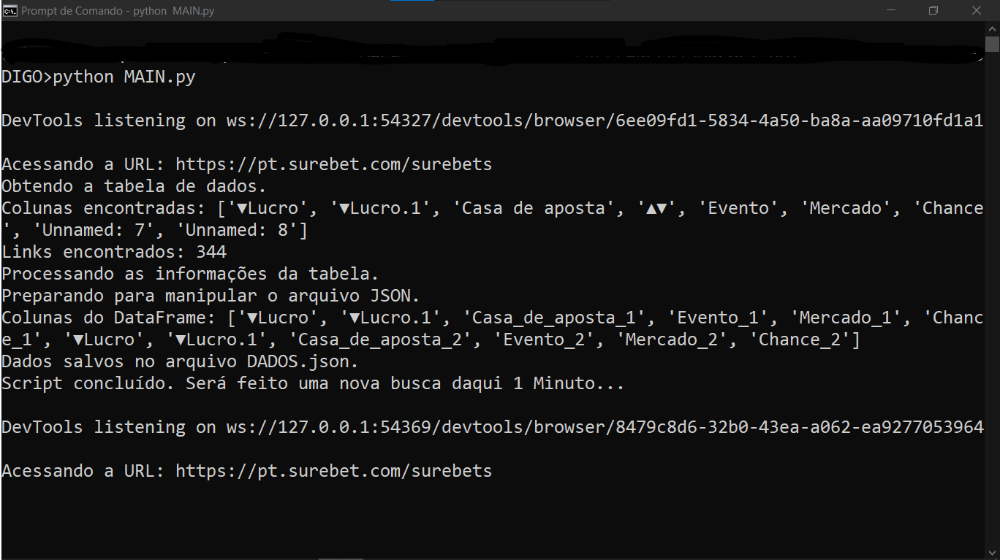
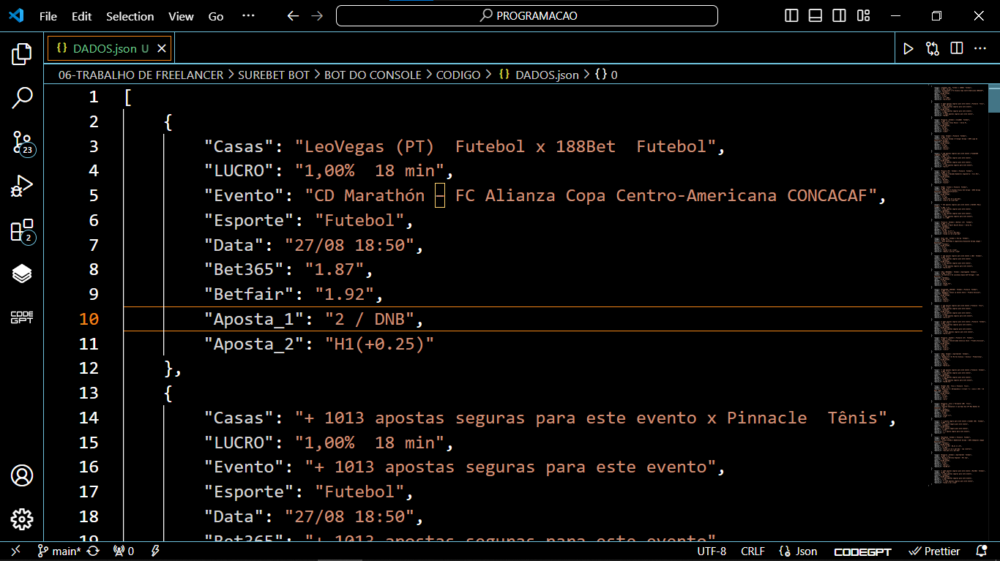

# SUREBET NO JSON
🤖BOT DO JSON DE INFORMAÇÕES SOBRE APOSTAS DO SITE SUREBET!

  
  

## DESCRIÇÃO:
Este bot automatiza a coleta de dados de uma tabela de apostas seguras do site [surebet](https://pt.surebet.com/surebets). Ele acessa a página, extrai a tabela, organiza e processa as informações relevantes (como lucro, casa de aposta, evento, mercado e chance) e os links e detalhes adicionais associados. Em seguida, ele salva os dados em um arquivo JSON chamado `DADOS.json`, combinando-os com informações previamente salvas. O bot também é programado para rodar em intervalos de um minuto, permitindo uma coleta contínua de dados, até que seja interrompido manualmente pelo usuário.

